# **FluencyHub - Sistema online para educação e treinamento de idiomas. API RESTful**


## **1. Apresentação**

Bem-vindo ao repositório do projeto **FluencyHub**. Este projeto é uma entrega do MBA DevXpert Full Stack .NET - Módulo 3.
O objetivo principal desenvolver uma aplicação educacional online.

### **Autor**
- **Jason Santos do Amaral**

## **2. Proposta do Projeto**

O projeto consiste em:

- **API RESTful:** Desenvolver uma plataforma educacional online com múltiplos bounded contexts (BC), aplicando DDD, TDD, CQRS e padrões arquiteturais para gestão eficiente de conteúdos educacionais, alunos e processos financeiros.


## **3. Tecnologias Utilizadas**

- **Linguagem de Programação:** C#
- **Frameworks:**
  - ASP.NET Web API
  - Entity Framework Core
- **Banco de Dados:** 
  - SQLite
  - SQL Server
- **Autenticação e Autorização:**
  - Autenticação: JWT com ASP.NET Core Identity
- **Documentação da API:** 
  - Swagger
- **Testes da API:** 
  - Postman
  - Testes de Unidade: Implementados via TDD (Test-Driven Development)
  - Testes de Integração: Validação dos fluxos completos do sistema
  - Framework de Testes: xUnit
  - Mocking e Helpers: Classes auxiliares para autenticação e operações comuns 

## **4. Estrutura do Projeto**

```mermaid
%%{init: {'theme': 'dark'}}%%
graph TD
    %% Configurações globais
    classDef title fill:#1a237e,color:#ffffff,stroke:none,font-size:20px
    classDef bc fill:#1e1e1e,stroke:#aaa,stroke-width:1.5px,color:#90caf9
    classDef entity fill:#2c2c2c,stroke:#90caf9,stroke-width:1px,color:#ffffff
    classDef relationship fill:#333,stroke:#888,stroke-dasharray:5

    %% Bounded Contexts
    subgraph BC1["Gestão de Conteúdo"]
        direction TB
        style BC1 fill:#2e7d32,stroke:#81c784,color:#ffffff
        C1(("Curso")):::entity
        A1["▪ Aula - Vídeos Materiais"]:::entity
        CP["▫ Conteúdo Programático- Objetivos - Ementa"]:::entity
        C1 --- A1
        C1 --- CP
    end

    subgraph BC2["Gestão de Alunos"]
        direction TB
        style BC2 fill:#ef6c00,stroke:#ffb74d,color:#ffffff
        AL(("Aluno")):::entity
        MT[Matrícula]:::entity
        CT[Certificado]:::entity
        HA[Histórico Acadêmico]:::entity
        AL -->|realiza| MT
        MT -->|gera| CT
        MT -->|registra| HA
    end

    subgraph BC3["Pagamento"]
        direction LR
        style BC3 fill:#c62828,stroke:#ef9a9a,color:#ffffff
        PG(("Pagamento")):::entity
        DC[[Dados do Cartão]]:::entity
        SP{Status}:::entity
        PG -->|processa| DC
        PG -->|atualiza| SP
    end

    %% Relacionamentos entre BCs
    BC1 --o|"Disponibiliza cursos"| BC2
    BC2 --o|"Gera cobranças"| BC3
    BC3 --o|"Notifica status"| BC2

    %% Elementos auxiliares
    class T title
    linkStyle 0,1,2 stroke:#90caf9,stroke-width:1.5px
    linkStyle 3,4,5 stroke:#ffb74d,stroke-width:1.5px
    linkStyle 6,7,8 stroke:#ef9a9a,stroke-width:1.5px

```


```
A estrutura do projeto é organizada da seguinte forma:
	FluencyHub/
	├── src/
	│   ├── API/
	│   │   ├── FluencyHub.API/             - API RESTful
	│   │   ├── FluencyHub.Application/     - Models, Services, Extensions
	│   │   ├── FluencyHub.Infrastructure/  - Repositórios, Migrations, Configurações do EF Core
	│   │   ├── FluencyHub.Domain/          - Modelos de Domínio, Agregados, Objetos de Valor
	├── tests/
	│   ├── FluencyHub.Tests/               - Testes de Unidade e Integração
	│   │   ├── Integration/                - Testes de Integração
	│   │   ├── Unit/                       - Testes de Unidade
	├── docs/                               - Documentação do Projeto
	├── FluencyHub.sln                      - Solução do Visual Studio
	├── README.md                           - Arquivo de Documentação do Projeto
	├── feedback.md                         - Arquivo para Consolidação dos Feedbacks
	├── .gitignore                          - Arquivo de Ignoração do Git

```

## **5. Funcionalidades Implementadas**

Gestão de Conteúdo
1.	Cadastro de Curso
•	Endpoint para criar um novo curso.
•	Validação dos dados do curso.
•	Persistência do curso no banco de dados.
2.	Cadastro de Aula
•	Endpoint para adicionar uma nova aula a um curso existente.
•	Validação dos dados da aula.
•	Persistência da aula no banco de dados.
3.	Consulta de Cursos
•	Endpoint para obter detalhes de um curso por ID.
•	Endpoint para listar todos os cursos.
•	Endpoint para listar cursos por idioma.
•	Endpoint para listar cursos por nível.
4.	Consulta de Aulas
•	Endpoint para obter as aulas de um curso específico.
Gestão de Alunos
1.	Cadastro de Aluno
•	Endpoint para criar um novo aluno.
•	Validação dos dados do aluno.
•	Persistência do aluno no banco de dados.
2.	Consulta de Aluno
•	Endpoint para obter detalhes do aluno autenticado.
•	Endpoint para obter detalhes de um aluno por ID.
3.	Atualização de Aluno
•	Endpoint para atualizar os dados de um aluno.
•	Validação dos dados atualizados.
4.	Ativação e Desativação de Aluno
•	Endpoint para ativar um aluno.
•	Endpoint para desativar um aluno.
Pagamento e Faturamento
1.	Processamento de Pagamento
•	Serviço para processar pagamentos utilizando o gateway de pagamentos da Cielo.
•	Validação dos dados do cartão.
•	Atualização do status do pagamento.
2.	Consulta de Status de Pagamento
•	Serviço para obter o status de um pagamento específico.
3.	Solicitação de Reembolso
•	Serviço para solicitar reembolso de um pagamento.
Autenticação e Usuários
1.	Autenticação JWT
•	Implementação de autenticação JWT para proteger a API.
•	Geração de tokens JWT para usuários autenticados.
2.	Login
•	Endpoint para login de usuários.
•	Validação das credenciais do usuário.
•	Geração de token JWT em caso de sucesso.
3.	Registro de Usuário
•	Endpoint para registro de novos usuários.
•	Validação dos dados do usuário.
•	Persistência do usuário no banco de dados.
•	Atribuição do papel "Student" ao novo usuário.

## **6. Como Executar o Projeto**

### **Pré-requisitos**

- .NET SDK 9.0 ou superior
- SQL Server - Opcional
- Visual Studio 2022 ou superior (ou qualquer IDE de sua preferência)
- Git

### **Passos para Execução**

1. **Clone o Repositório:**
   - `git clone https://github.com/jasonamaral/mba.modulo3.git`
   - `cd mba.modulo3`

2. **Configuração do Banco de Dados:**
   - Não há necessidade

3. **Executar a API:**
   - `cd src/FluencyHub.API/`
   - `dotnet run`
   - Acesse a documentação da API em: https://localhost:7152/index.html

## **7. Instruções de Configuração**

- **JWT para API:** As chaves de configuração do JWT estão no `appsettings.json`.
- **Migrações do Banco de Dados:** As migrações são gerenciadas pelo Entity Framework Core. Não é necessário aplicar devido a configuração do Seed de dados.

## **8. Documentação da API**

A documentação da API está disponível através do Swagger. Após iniciar a API, acesse a documentação em:

https://localhost:7152/index.html

## **9. Avaliação**

- Este projeto é parte de um curso acadêmico e não aceita contribuições externas. 
- Para feedbacks ou dúvidas utilize o recurso de Issues
- O arquivo `FEEDBACK.md` é um resumo das avaliações do instrutor e deverá ser modificado apenas por ele.
